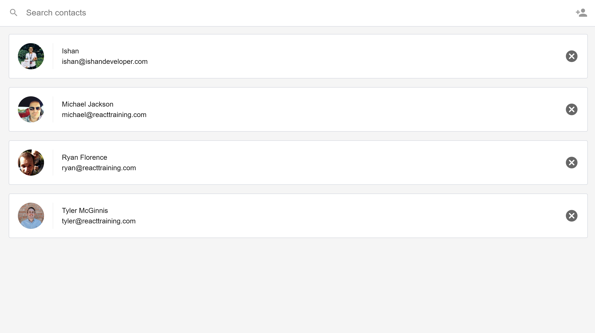

This repository contains the final project files of the Contacts App in [Udacity's React Nanodegree Program](https://www.udacity.com/course/react-nanodegree--nd019).

This repository contains the frontend for the Contacts app, make sure to first download and set up the server separately below.

## Screenshots

## Project Setup

1. Clone the Project
<pre>git clone https://github.com/ishandeveloper/nanodegree-contacts</pre>
2. Go into the directory where the project now lives <pre>cd nanodegree-contacts</pre>
3. Install the dependencies - `yarn install`
4. Start the app - `yarn start`

## Server Set Up

Getting the server running on your local machine takes only a few steps:

1. clone the project -
<pre>git clone https://github.com/udacity/reactnd-contacts-server.git</pre>
2. Move into desired directory
<pre>cd reactnd-contacts-server</pre>
3. Install The dependencies
<pre>
npm install
</pre>
4. Start the server
<pre>npm start
</pre>

## Learn More

To learn React, check out the [React documentation](https://reactjs.org/).

##### Made with ♥ by <a href="https://github.com/ishandeveloper">ishandeveloper</a>

